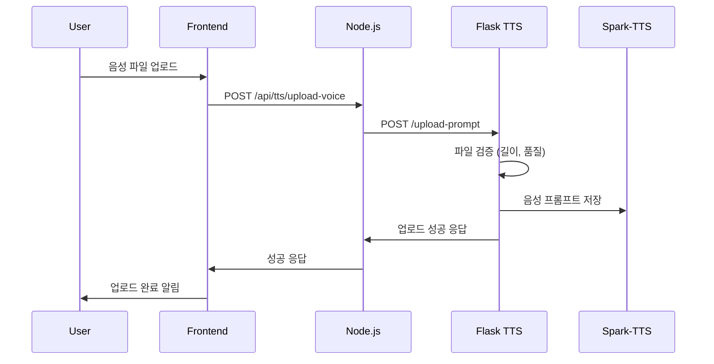
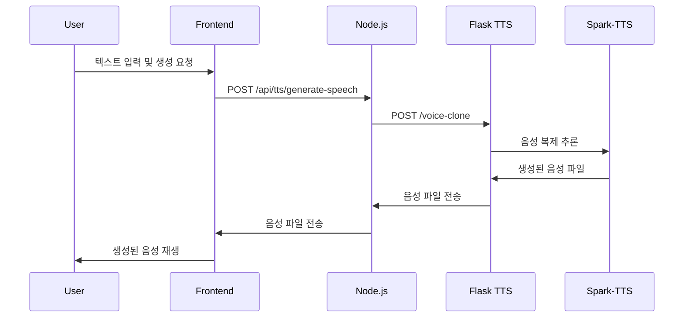

# Voice NFT Trading Platform - TTS 통합 가이드

## 🎯 개요

이 가이드는 프론트엔드에서 사용자 음성 샘플 업로드부터 Flask 백엔드에서 Spark-TTS 모델을 이용한 음성 생성까지의 전체 통합 과정을 설명합니다.

## 🏗️ 시스템 아키텍처

```
프론트엔드 (React) → Node.js 백엔드 → Flask TTS 서버 (Spark-TTS)
     ↓                    ↓                    ↓
  음성 업로드 UI      API 라우팅/인증      AI 음성 학습/생성
```

### 구성 요소

1. **프론트엔드 (React)**: 사용자 인터페이스 및 음성 업로드
2. **Node.js 백엔드**: API 라우팅, 인증, 파일 처리
3. **Flask TTS 서버**: Spark-TTS 모델을 이용한 음성 학습 및 생성
4. **Spark-TTS**: 음성 복제 및 TTS 생성 AI 모델

## 📋 필수 요구사항

### 시스템 요구사항

- Python 3.8+
- Node.js 16+
- GPU (권장) 또는 CPU
- 최소 8GB RAM

### 의존성

- PyTorch 2.0+
- Flask
- Express.js
- React

## 🚀 설치 및 실행

### 1. 자동 설치 및 실행 (권장)

```bash
# 프로젝트 루트에서 실행
cd src/backend/Spark-TTS-main
./start_servers.sh
```

이 스크립트는 다음 작업을 자동으로 수행합니다:

- Spark-TTS 모델 다운로드
- Python/Node.js 의존성 설치
- 모든 서버 실행

### 2. 수동 설치 및 실행

#### 2.1 Spark-TTS 모델 다운로드

```bash
cd src/backend/Spark-TTS-main
python download_model.py
```

#### 2.2 Python 의존성 설치

```bash
pip install -r requirements.txt
```

#### 2.3 Flask TTS 서버 실행

```bash
python flask_server.py
# 서버 실행: http://localhost:5000
```

#### 2.4 Node.js 백엔드 실행

```bash
cd src/backend/node
npm install
node server.js
# 서버 실행: http://localhost:3001
```

#### 2.5 React 프론트엔드 실행

```bash
cd src/frontend
npm install
npm start
# 서버 실행: http://localhost:3000
```

## 🔄 데이터 플로우

### 1. 음성 업로드 과정



### 2. TTS 생성 과정



## 📁 파일 구조

```
Voice_NFT_Trading/
├── src/
│   ├── frontend/                 # React 프론트엔드
│   │   ├── src/
│   │   │   ├── pages/
│   │   │   │   ├── CreatePage.js      # 음성 업로드 페이지
│   │   │   │   └── tts/TTSPage.js     # TTS 생성 페이지
│   │   │   └── services/api.js        # API 호출 서비스
│   │   └── package.json
│   └── backend/
│       ├── node/                 # Node.js 백엔드
│       │   ├── controllers/tts.controller.js
│       │   ├── services/tts.service.js
│       │   ├── routes/tts.routes.js
│       │   └── server.js
│       └── Spark-TTS-main/       # Flask TTS 서버
│           ├── flask_server.py   # Flask 서버 메인
│           ├── webui.py         # Gradio UI (선택사항)
│           ├── requirements.txt
│           └── start_servers.sh  # 자동 실행 스크립트
```

## 🔧 API 엔드포인트

### Node.js 백엔드 API

| 메서드 | 엔드포인트                      | 설명                |
| ------ | ------------------------------- | ------------------- |
| POST   | `/api/tts/upload-voice`         | 음성 파일 업로드    |
| POST   | `/api/tts/generate-speech`      | TTS 음성 생성       |
| GET    | `/api/tts/voice-status/:userId` | 음성 모델 상태 확인 |

### Flask TTS 서버 API

| 메서드 | 엔드포인트                | 설명                    |
| ------ | ------------------------- | ----------------------- |
| GET    | `/health`                 | 서버 상태 확인          |
| POST   | `/upload-prompt`          | 음성 프롬프트 업로드    |
| POST   | `/voice-clone`            | 음성 복제 TTS 생성      |
| GET    | `/voice-status/<user_id>` | 사용자 음성 모델 상태   |
| POST   | `/generate-voice`         | 파라미터 기반 음성 생성 |

## 💡 주요 기능

### 1. 음성 업로드 및 검증

- 지원 형식: WAV, MP3, M4A, FLAC
- 최소 길이: 10초 (권장: 30초 이상)
- 자동 품질 검증 및 전처리

### 2. AI 음성 학습

- Spark-TTS 모델 기반 음성 복제
- 실시간 학습 진행률 표시
- 사용자별 음성 모델 관리

### 3. TTS 생성

- 학습된 음성으로 텍스트 변환
- 실시간 음성 생성 및 재생
- 다양한 텍스트 길이 지원

### 4. 음성 파라미터 제어

- 성별: 남성/여성
- 피치: 매우 낮음 ~ 매우 높음
- 속도: 매우 느림 ~ 매우 빠름

## 🔒 보안 고려사항

### 1. 파일 업로드 보안

- 파일 확장자 검증
- 파일 크기 제한 (최대 50MB)
- 안전한 파일명 생성

### 2. 사용자 인증

- JWT 토큰 기반 인증
- 사용자별 음성 모델 격리
- API 접근 권한 제어

### 3. 데이터 보호

- 사용자 음성 파일 암호화 저장
- 임시 파일 자동 삭제
- CORS 설정으로 크로스 오리진 제어

## 🐛 트러블슈팅

### 1. 모델 다운로드 실패

```bash
# 수동 모델 다운로드
cd src/backend/Spark-TTS-main
python download_model.py
```

### 2. GPU 메모리 부족

```bash
# CPU 모드로 실행
export CUDA_VISIBLE_DEVICES=""
python flask_server.py
```

### 3. 포트 충돌

- Flask TTS 서버: 5000 포트
- Node.js 백엔드: 3001 포트
- React 프론트엔드: 3000 포트

각 서버의 포트를 변경하여 충돌을 해결하세요.

### 4. 의존성 설치 오류

```bash
# Python 의존성 재설치
pip install --force-reinstall -r requirements.txt

# Node.js 의존성 재설치
rm -rf node_modules package-lock.json
npm install
```

## 📈 성능 최적화

### 1. GPU 가속

- CUDA 또는 MPS 사용 시 10-20배 빠른 처리
- 메모리 사용량 모니터링 필요

### 2. 모델 캐싱

- 모델 초기화 시간 단축
- 메모리 효율적 사용

### 3. 비동기 처리

- 음성 생성 중 UI 반응성 유지
- 백그라운드 작업 처리

## 🔮 향후 개선사항

1. **실시간 스트리밍**: 긴 텍스트에 대한 실시간 음성 생성
2. **음성 품질 향상**: 더 자연스러운 음성 생성
3. **다국어 지원**: 영어, 중국어 등 다양한 언어 지원
4. **감정 제어**: 기쁨, 슬픔 등 감정 표현 제어
5. **배치 처리**: 여러 텍스트 동시 처리

## 📞 지원

문제가 발생하거나 질문이 있으시면:

1. GitHub Issues 등록
2. 로그 파일 확인 (`flask_server.py` 실행 로그)
3. 시스템 요구사항 재확인

---

**🎉 축하합니다! Voice NFT Trading Platform의 TTS 통합이 완료되었습니다.**
